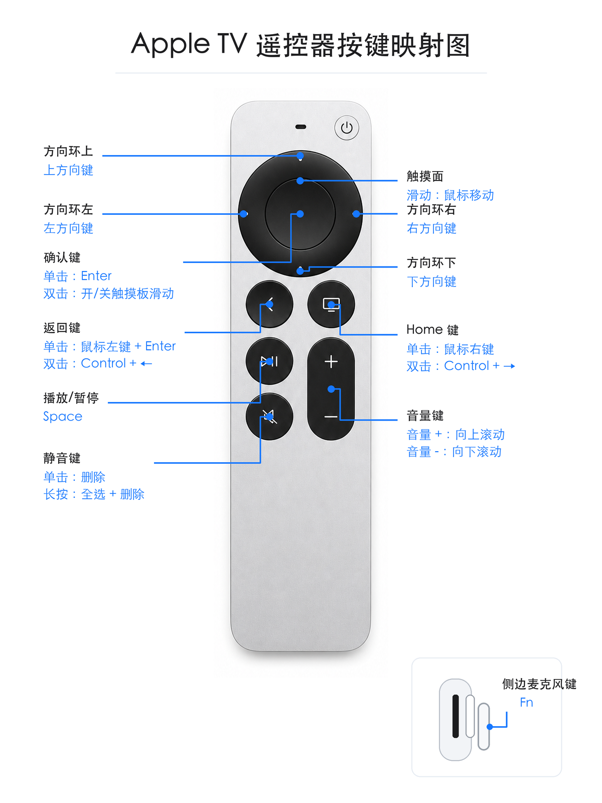

# Siri Remote Karabiner Setup Skill

这是一个 Codex skill，用来把 Apple TV Siri Remote 变成 macOS 遥控器。

它包含两部分：

- Karabiner-Elements 按键映射：把遥控器实体按键映射成方向键、Enter、鼠标左右键、桌面切换、删除等动作。
- 触摸滑动 App：监听遥控器中间触摸面，让触摸滑动模拟鼠标移动。

## 适用范围

- 系统：macOS 13 Ventura 及以上更推荐；当前已在 macOS 26.5.1 上验证。
- 设备：Apple TV Siri Remote，当前映射以银色款 Siri Remote 为主。
- 依赖：Karabiner-Elements、Node.js 18+、系统自带编译工具链。
- 权限：安装后需要用户手动允许辅助功能、输入监控等 macOS 权限。

这个仓库会修改本机 Karabiner 配置，并安装一个本地 App 到 `/Applications/SiriRemoteHIDProbe.app`。首次使用前建议先运行 `--dry-run` 预演。

## 兼容性和已知风险

- Karabiner-Elements 官方当前支持 macOS 13 Ventura 到 macOS 27 Golden Gate，并支持 Intel Mac 和 Apple Silicon Mac。
- 实体按键映射主要依赖 Karabiner，跨 macOS 版本的兼容性最好。
- 触摸滑动 App 使用 macOS 私有 `MultitouchSupport` 接口。它能实现遥控器触摸面模拟鼠标，但 macOS 大版本升级后可能需要重新验证。
- 不建议把当前机器编译出来的 `.app` 直接发给别人用。当前本机编译产物是 Apple Silicon 的 `arm64`，最低系统版本会跟随本机 SDK；其他 Mac 应优先在本机运行安装脚本重新编译。
- 当前遥控器识别条件写死为 Apple `vendor_id: 76`、`product_id: 789`。如果换了另一代 Apple TV Remote，可能需要先用 Karabiner-EventViewer 或 `karabiner_cli --list-connected-devices` 确认设备 ID。
- 安装脚本会备份但也会改写 `~/.config/karabiner/karabiner.json`。如果用户已有复杂 Karabiner 配置，安装前一定先保存备份。
- macOS 权限不能被脚本绕过。首次运行仍需要用户手动允许辅助功能、输入监控、Karabiner 系统扩展等权限。

## 映射图



## 主要功能

- 上、下、左、右实体键映射为键盘方向键。
- 单击确认键映射为 `Enter`。
- 双击确认键开启/关闭触摸面鼠标滑动。
- 返回键单击映射为鼠标左键 + `Enter`，双击映射为 `Control + ←`。
- Home 键单击映射为鼠标右键，双击映射为 `Control + →`。
- 静音键单击删除，长按全选并清空。
- 音量键映射为上下滚动。
- 侧边麦克风键单击映射为 `Fn`，双击映射为 `Esc`。

## 遥控器切换

如果需要在 Apple TV 和 Mac 之间切换遥控器连接，看：

- [新款 Apple TV 遥控器切换教程](references/remote-switching.md)

## 一键安装

在仓库根目录运行：

```bash
node touch-mouse-app/tools/install-touch-mouse-app.mjs
```

首次安装前建议先预演：

```bash
node touch-mouse-app/tools/install-touch-mouse-app.mjs --dry-run
```

安装后，macOS 仍然需要手动开启辅助功能、输入监控等系统权限。

## 隐私和权限

- 触摸滑动 App 只在本机运行，不上传输入数据。
- App 会监听 Apple TV 遥控器触摸面输入，并在开启模式下模拟鼠标移动。
- Karabiner 配置会改写 `~/.config/karabiner/karabiner.json`。
- 安装脚本会自动备份旧的 Karabiner 配置到 `~/.config/karabiner/automatic_backups/`。

## 卸载和恢复

停止并删除触摸滑动 App：

```bash
pkill -f SiriRemoteHIDProbe
rm -rf /Applications/SiriRemoteHIDProbe.app
```

恢复 Karabiner 配置：

1. 打开 `~/.config/karabiner/automatic_backups/`。
2. 找到安装前生成的 `karabiner-before-touch-mouse-install-*.json`。
3. 复制回 `~/.config/karabiner/karabiner.json`。
4. 重启 Karabiner-Elements。

如果只想临时关闭触摸面鼠标移动，双击当前配置的开关键即可，默认是双击确认键。

## 修改触摸滑动开关键

编辑：

```text
touch-mouse-app/remote-settings.json
```

然后重新生成 Karabiner 配置：

```bash
node touch-mouse-app/tools/configure-touch-toggle.mjs
```

## 目录说明

- `SKILL.md`：Codex skill 主说明。
- `assets/`：映射图和 Karabiner 导入配置。
- `references/`：安装、事件映射、排错说明。
- `scripts/`：Karabiner 配置安装脚本和映射图生成脚本。
- `touch-mouse-app/`：触摸面鼠标移动 App 源码和一键安装脚本。

## 许可证

MIT
